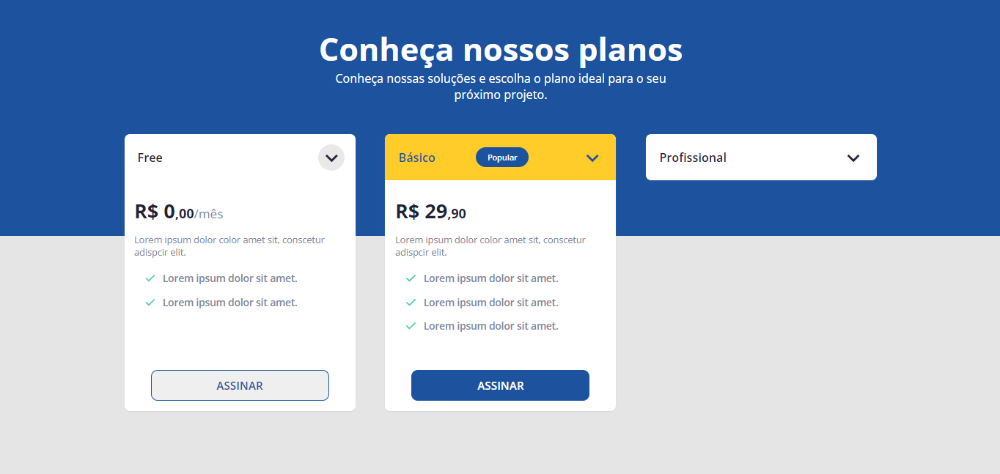

# PricingTable - RocketSeat

<!---Esses são exemplos. Veja https://shields.io para outras pessoas ou para personalizar este conjunto de escudos. Você pode querer incluir dependências, status do projeto e
 informações de licença aqui--->

> Challenge proposed by RocketSeat, to develop a homepage for a price list of a company's services.

### Aplication link

Link: <a>http://jgsl-rocketprice.netlify.app</a>

### Adjustments and improvementsA

The project has been finished.

- [x] Body with HTML
- [x] Stilization with CSS
- [x] Class toggles with JavaScript
- [x] Responsiveness

## 🤝 Collaborator

We thank the following people who contributed to this project:

<table>
  <tr>
    <td align="center">
      <a href="#">
         
        
          <b>João Guilherme</b>
        
      </a>
    </td>
  </tr>
</table>

## 👨‍💻 Technologies
Technologies used in the project:

